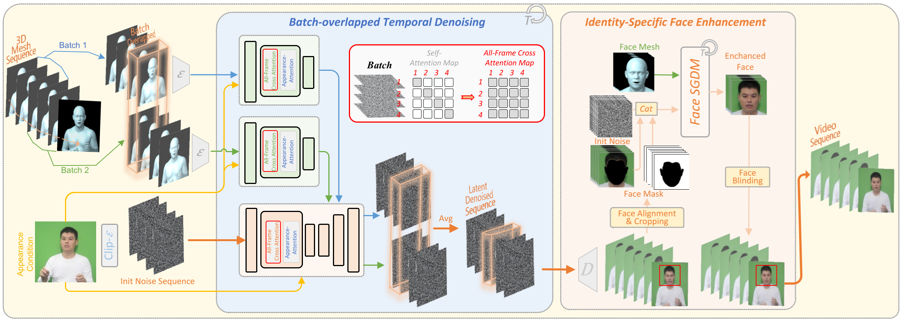

# Make-Your-Anchor: A Diffusion-based 2D Avatar Generation Framework

## Pipeline


### 1. Environment Setup

We can install Miniconda on Machine 189 (which can access NAS5). Once this is done, we can reuse this environment when we run jobs on the Colovore SLURM cluster.

NOTE: If you plan to work on Colovore SLURM, please remember to install Miniconda on your working directory (/ndata/user/\<your\_usename\>/).

The installation of miniconda comprises two steps, as detailed below.

#### 1.1 Install basic env:

a. Download script: 
  ```
  wget https://repo.anaconda.com/miniconda/Miniconda3-latest-Linux-x86_64.sh
  ```

b. Run the script to install: 
  ```
  bash https://repo.anaconda.com/miniconda/Miniconda3-latest-Linux-x86_64.sh
  ```

#### 1.2 Create conda "mya" env for make-your-anchor model training / inference 

The procedure is given below:

```
1. conda create -n "mya" python=3.8
2. conda activate mya
3. pip3 install -r requirements.txt
```

Finally, check if your conda env is installed properly by typing:

~~~
which python3
~~~

To process videos, [FFmpeg](https://ffmpeg.org//) is required to be installed.


### 2. Inference Pipeline

Before running the pipeline, MAKE SURE you place the repo ```paii_virtual_being_3d``` at ```../``` (same level as the current repo)

The pipeline reads in the config file at ```inference/configs/inference_config.sh```. In the config file, there are a few required input parameters:

#### 2.1 parameters:

##### Required parameters:

- ```raw_video_path```: Input video path (in mp4 format)
- ```ref_coord```: coordinates of top-left corner of the crop window, default is "(0,0)"
- ```body_weight_dir```: Checkpoint of the body model to be used
- ```head_weight_dir```: Checkpoint of the head model to be used
- ```save_root```: Output root directory. The results are stored at <save_root>/<video_basename> where ```video_basename``` is the basename of the video file

##### Optional parameters:

- ```body_prompt_img_pth```: Body appearance image. If not given, the first frame of the input video will be used.
- ```head_prompt_img_pth```: Head appearance image. If not given, the first frame of the input video will be used.
- ```body_input_dir```: Pose mesh directory. If this is set, please set stage=0 to skip video preprocessing, i.e. input video will not be used
- ```stage```: Stage of the pipeline. Default is ```-1```. If you want to skip video preprocessing and start with pose mesh from SHOW, just set it to ```0``` 


#### 2.2 About the pipeline

After the above parameters are set, we can run the complete inference pipeline in ```three``` steps:

##### Step 1:

With ```stage=-2```, we preprocess the input video using the following command.
~~~
cd inference
bash run_inference.sh configs/inference_config -2
~~~

##### Step 2:

After the video preprocessing is done (stopped at step=0 saying mesh is not found), we run SHOW in docker env to get the pose mesh of the input video. The details of running SHOW (```Section 2.4```) can be found at [SHOW inference](http://124.196.65.21:8081/paii/paii_virtual_being_3d/-/tree/main/third_party/SHOW?ref_type=heads)

Basically, after we are in the docker env, we run the following command:

~~~
cd /paii_virtual_being_3d/third_party/SHOW
bash run_main.py show_config_<video_id>.sh
~~~

##### Step 3:

In the current implementation, the inference pipeline is limited to ONE single video clip. This constraint will be lifted in the near future.

Once we have the generated pose mesh in ```tools/paii_virtual_being_3d/third_party/SHOW/outputs/*```, we run the inference script again:

~~~
bash run_inference.sh configs/inference_config 0
~~~

In the inference pipeline, the most time consuming step is at ```stage=1``` for body inference. That usually takes about 60 minutes. For a 15-second video, the pipeline takes about 105 mins (including SHOW pose generation).


#### 2.3 Model management

Existing MYA models can be looked up below:

[Model list](https://docs.google.com/spreadsheets/d/1G8rSIZGSXSgWMaaDpjoAQIXoEuoKANAYmSiWOY7XBN4/edit?gid=1253676734#gid=1253676734)


#### 2.4 Output directory

If the input video is named ```test_video.mp4``` and ```save_root=./outputs```, then the outputs are stored at ```outputs/test_video```. The structure of the output directory is illustrated below:

```
|-- outputs
  |-- test_video
    |-- final_output.mp4
    |-- raw
      |-- test_video.mp4
    |-- norm
      |-- info.json
      |-- crop.mp4
      |-- crop
        |-- images
        |-- clips
          |-- 000000
            |-- images
          |-- 000001
            |-- images
          |-- ...
      |-- crop_resize.mp4
      |-- crop_resize
        |-- images
        |-- clips
          |-- 000000
            |-- mesh
            |-- images
          |--	 000001
          |-- ...
    |-- *
		
```


